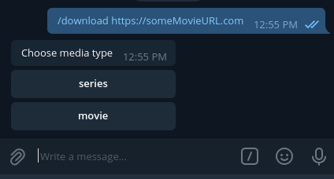

# botzilla

    

**Botzilla** is a **Telegram** bot for forwarding download actions to **jDownloader2**

## What u need
 * Telegram
 * jDownloader2
 * Somewhere to run the docker container

## How to get started

* Create a new Telegram account if u don't already have one.
* Just create a bot in Telegram with the help of **[botfather](https://core.telegram.org/bots#6-botfather)**.
* Start a chat with your bot.
* Rename the **.env-sample** file to **.env** and the the `botToken`Shokodev/botzilla and `jDownlaoder` url.
* **Jdownloader2 Settings**: 
   - Disable "Create Subfolder by Packagename" in Packagizer
   - Enable RemoteAPI: Deprecated Api*
* Build the docker image and get it running. 
* Start chatting with your bot, try `hi` or `/help` to see if the bot is running properly.

  

[shokodev-img]:      https://shokodev.ch/img/LogoDarkStyleSVG-Title.5b9e0f01.svg
[shokodev]:          https://shokodev.ch
